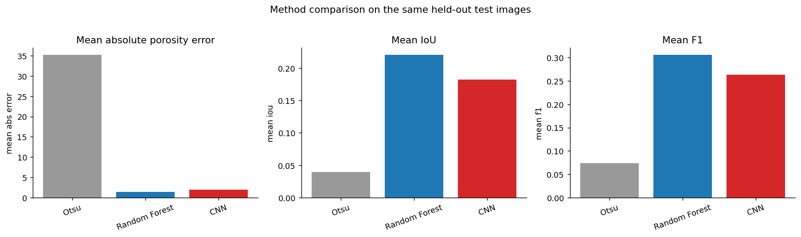
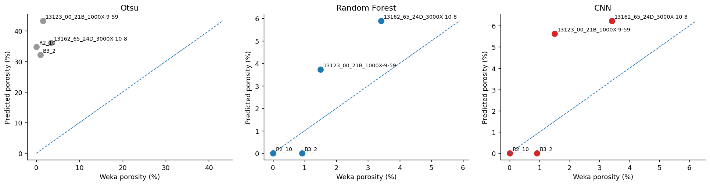
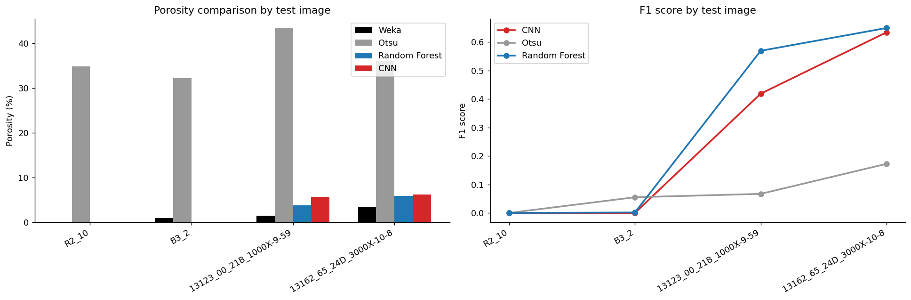
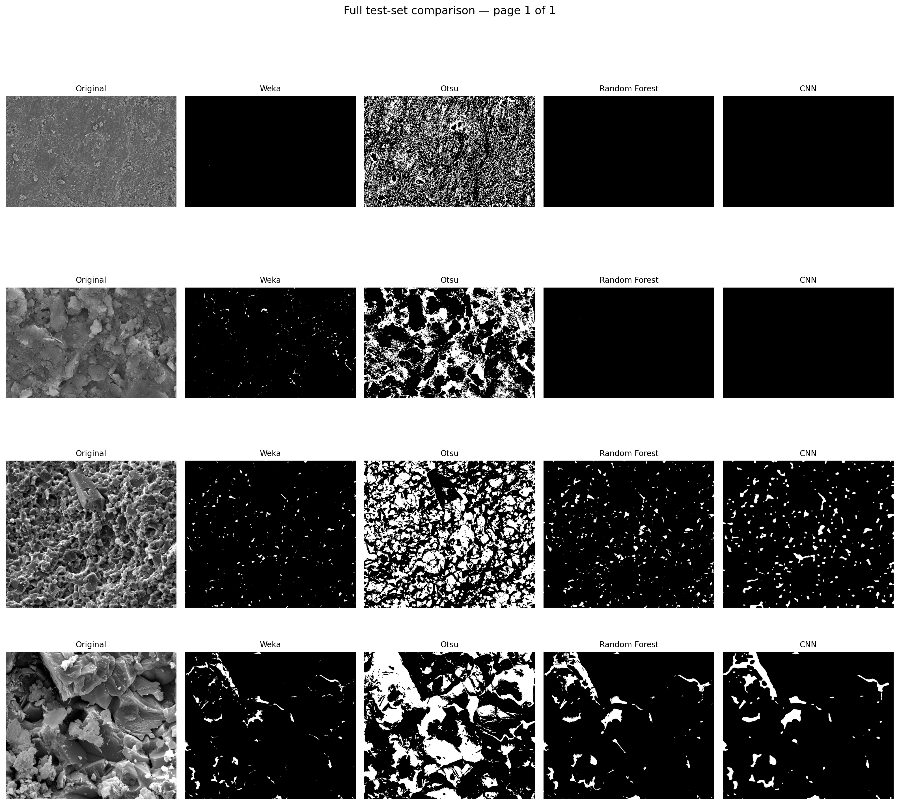

# GEOL0069 Final Project – SEM/BSE Pore Segmentation using Classical Image Processing and Machine Learning

**University College London – GEOL0069 Artificial Intelligence for Earth Observation (AI4EO)**  
**Author:** Courtney Orla Brown  

This project investigates how different image segmentation approaches affect pore detection and porosity estimation in **SEM/BSE imagery**. The main aim is to compare a simple classical thresholding baseline (**Otsu thresholding**) with two supervised learning approaches (**Random Forest** and a **patch-based Convolutional Neural Network, CNN**) using **Trainable Weka Segmentation masks as the reference labels**. The project was designed to test whether machine learning methods can reproduce expert-guided pore segmentation more reliably than thresholding alone, and to examine how segmentation quality influences derived porosity estimates.

---

## Project Overview

Accurate pore segmentation is essential because porosity estimates depend directly on how pore boundaries are defined. In grayscale microscopy imagery, this can be difficult because pores may be subtle, sparse, irregular in shape, and visually similar to surrounding phases. Classical thresholding methods such as Otsu rely only on grayscale intensity, whereas supervised machine learning approaches can make use of more complex information such as local texture, edge structure, and spatial context. This project compares these different strategies in a consistent workflow using Weka-derived pore masks as the reference standard. [Arganda-Carreras et al., 2017](https://academic.oup.com/bioinformatics/article/33/15/2424/3092362) [ImageJ.net](https://imagej.net/Trainable_Weka_Segmentation) [Shi et al., 2023](https://www.sciencedirect.com/science/article/pii/S2949908923001504)

### Project Aim

The aim of this project is to evaluate whether supervised segmentation methods can reproduce Weka reference masks and porosity values more reliably than global thresholding in SEM/BSE pore images.

### Research Questions

1. How well does **Otsu thresholding** segment pores compared with the Weka reference masks?
2. Does a **Random Forest** model provide more accurate pore segmentation than Otsu thresholding?
3. Can a **simple patch-based CNN** improve on the Random Forest baseline?
4. How strongly does segmentation method influence the final **porosity estimate**?

---

## Methods Compared

### 1. Trainable Weka Segmentation (reference masks)

Trainable Weka Segmentation was used to generate the reference pore masks for this project. Weka treats segmentation as a **pixel-classification** problem, where a user labels example pixels and a classifier is then trained to segment the remaining image. It is particularly relevant because it combines image-processing features with machine learning, allowing segmentation decisions to use more than raw grayscale intensity alone. [Arganda-Carreras et al., 2017](https://academic.oup.com/bioinformatics/article/33/15/2424/3092362)

According to the ImageJ documentation, Trainable Weka Segmentation can use a range of features sensitive to intensity, texture, edges, and local structure, and its default classifier is **FastRandomForest**. This makes it a strong reference workflow for complex microscopy segmentation problems where pore boundaries are not easily separated by a single threshold. [ImageJ.net](https://imagej.net/Trainable_Weka_Segmentation)


*Figure adapted from the Trainable Weka Segmentation workflow described by Arganda-Carreras et al. (2017).*  
Source: https://academic.oup.com/bioinformatics/article/33/15/2424/3092362

### 2. Otsu Thresholding

Otsu thresholding was used as a classical baseline. It is a widely used histogram-based method that chooses a global threshold to separate foreground and background based on grayscale distribution. In this project, it provides a simple non-learning benchmark against which the supervised methods can be compared. [Otsu, 1979](https://doi.org/10.1109/TSMC.1979.4310076)

### 3. Random Forest

A Random Forest classifier was trained in Python to predict pore and non-pore pixels using the Weka masks as labels. This method provides a supervised learning baseline that is conceptually close to Weka’s feature-based pixel classification, while being implemented separately in Python for direct comparison.

### 4. Patch-based CNN

A small patch-based CNN was trained to classify image patches centred on pixels and then rolled out across the test images to produce predicted pore masks. This provides a simple deep learning comparison and tests whether a lightweight neural network can improve segmentation performance on this small dataset.

---

## Why This Matters

The choice of segmentation method has a direct effect on measured porosity and therefore on any downstream interpretation of pore structure. In pore-image analysis, threshold-based methods are often sensitive to gray-value ambiguity, imaging contrast, and boundary uncertainty, which can introduce large variability into porosity estimates. Shi, Misch and Vranjes-Wessely (2023) showed that conventional thresholding can produce substantial variability in pore structural investigations, while machine learning approaches can improve robustness by combining multiple features such as intensity, texture, and edge information into a probability-based segmentation. [Shi et al., 2023](https://www.sciencedirect.com/science/article/pii/S2949908923001504)

This is also consistent with broader SEM segmentation challenges identified in the literature, including **contrast heterogeneity**, **multi-phase microstructures**, **irregular pore geometries**, **broad pore-size distributions**, and the limited availability of annotated SEM datasets for training and evaluation. These issues help explain why pore segmentation can be difficult and why benchmark comparisons between classical and learning-based approaches are important. [Zhang et al., 2026](https://pmc.ncbi.nlm.nih.gov/articles/PMC12546815/)

---
## Data
The dataset consists of **BSE SEM images** collected at multiple magnifications, including:

- **400×**
- **1000×**
- **2000×**
- **3000×**

For each selected image, the project may include:

- raw SEM image
- cropped image
- Weka segmentation mask
- probability map
- binary pore mask
- porosity measurement

The workflow uses a small number of carefully selected images in order to build an interpretable proof-of-concept comparison between methods.
---
## Key Findings

- **Otsu thresholding performed worst overall**, consistently overestimating porosity relative to the Weka reference masks.
- **Random Forest produced the strongest and most consistent results** across the held-out test images.
- The **CNN produced reasonable predictions on higher-porosity images**, but did **not clearly outperform the Random Forest** on this small dataset.
- The project shows that **segmentation choice strongly affects porosity estimation**, and that supervised learning is more suitable than thresholding alone for this SEM/BSE pore-segmentation task.

---
## Example Results

### Method-level comparison
The figure below summarises the mean performance of the three Python-based methods on the held-out test set. Otsu has by far the largest porosity error, while the Random Forest gives the strongest mean IoU and F1 performance.



### Predicted vs reference porosity
The scatter plots below compare each method’s predicted porosity against the Weka-derived reference porosity. Otsu consistently overestimates pore space, while the Random Forest and CNN remain much closer to the expected values.



### Porosity and F1 score by test image
The figure below shows how predicted porosity and F1 score vary for each held-out test image. This highlights the poor behaviour of Otsu, the stronger consistency of the Random Forest, and the more mixed performance of the CNN.



### Qualitative comparison
Visual comparison of the segmentation masks shows the same overall pattern: Otsu tends to classify too much dark material as pore space, whereas the Random Forest and CNN produce masks that are more similar to the Weka-derived reference.



---

## Repository Structure

```text
GEOL0069-sem-segmentation-project/
├── README.md
├── requirements.txt
├── data/
│   ├── cropped/
│   ├── masks_weka/
│   └── metadata/
├── figures/
├── notebooks/
│   ├── 01_data_loading_and_inventory.ipynb
│   ├── 02_otsu_baseline.ipynb
│   ├── 03_random_forest.ipynb
│   ├── 04_cnn_patch_classifier.ipynb
│   └── 05_evaluation_and_comparison.ipynb
├── predictions/
├── tables/

## Notebook Guide

### `01_data_loading_and_inventory.ipynb`
Loads the SEM/BSE image inventory, checks file structure, and prepares the dataset for the later experiments.

### `02_otsu_baseline.ipynb`
Implements Otsu thresholding as a classical baseline method and evaluates its pore masks and porosity estimates against the Weka reference masks.

### `03_random_forest.ipynb`
Trains and evaluates a Random Forest classifier using the Weka masks as labels, then produces predicted masks, summary metrics, and porosity values.

### `04_cnn_patch_classifier.ipynb`
Builds a patch-based CNN, trains it on labelled image patches, rolls the model out over the test images, and evaluates the resulting pore predictions.

### `05_evaluation_and_comparison.ipynb`
Compares all methods side by side using consistent metrics and visualisations, and discusses the implications for pore segmentation and porosity estimation.

---

## Evaluation metrics
The methods are compared using both **segmentation metrics** and **derived porosity values**.

### Segmentation metrics
- **IoU (Intersection over Union)** — overlap between predicted and reference pore masks
- **Precision** — fraction of predicted pore pixels that are correct
- **Recall** — fraction of true pore pixels successfully recovered
- **F1 score** — harmonic mean of precision and recall, useful when pore pixels are sparse relative to the background

### Quantitative pore metric
- **Porosity (%)** — calculated from the binary pore masks and compared across methods

Together, these metrics allow the project to assess not only whether a method produces visually plausible masks, but also whether it gives **realistic quantitative porosity estimates**.
---

## Discussion

The results show that **simple thresholding is not sufficient** for this dataset. Otsu thresholding consistently overestimated porosity, indicating that grayscale intensity alone was not enough to isolate pore space reliably in these SEM/BSE images. This is consistent with published work showing that threshold-based pore segmentation can be highly sensitive to gray-value cutoffs and can produce large variability in pore structural measurements.

By contrast, the supervised approaches produced much more realistic pore predictions. The **Random Forest** showed the strongest agreement with the Weka masks overall, suggesting that a feature-based machine learning approach is better able to capture the subtle pore characteristics present in the images. The **CNN** learned some useful pore features and performed reasonably on higher-porosity examples, but its performance was less consistent on very sparse pore images and it did not clearly surpass the Random Forest on this limited dataset.

The strong performance of the Weka-derived reference workflow is also meaningful. Trainable Weka Segmentation combines manual expert guidance with machine learning and a configurable set of image features, making it especially suitable for segmentation tasks where pore boundaries are subtle and where texture, edges, and local context matter.

Overall, this project demonstrates that **segmentation quality is not just a technical detail but a scientific issue**, because the chosen segmentation strategy directly affects the resulting porosity values and therefore the interpretation of the material microstructure.

---

## Requirements

This project was developed in Python using Jupyter/Colab notebooks. Main packages include:

- `numpy`
- `pandas`
- `matplotlib`
- `scikit-image`
- `scikit-learn`
- `tensorflow`
- `opencv-python`
- `jupyter`

Install dependencies with:

```bash
pip install -r requirements.txt

## How to Use This Repository

1. Open the notebooks in the `notebooks/` folder.
2. Run them in numerical order from `01` to `05`.
3. Use the Weka masks as the reference labels throughout the workflow.
4. Review the final comparison notebook for the full evaluation and discussion.

---

## References

- Arganda-Carreras, I., Kaynig, V., Rueden, C., Eliceiri, K.W., Schindelin, J., Cardona, A. and Seung, H.S., 2017. *Trainable Weka Segmentation: a machine learning tool for microscopy pixel classification*. **Bioinformatics**, 33(15), pp.2424–2426. https://doi.org/10.1093/bioinformatics/btx180

- ImageJ, 2026. *Trainable Weka Segmentation*. Available at: https://imagej.net/Trainable_Weka_Segmentation

- Otsu, N., 1979. *A threshold selection method from gray-level histograms*. **IEEE Transactions on Systems, Man, and Cybernetics**, 9(1), pp.62–66. https://doi.org/10.1109/TSMC.1979.4310076

- Shi, X., Misch, D. and Vranjes-Wessely, S., 2023. *A comprehensive assessment of image processing variability in pore structural investigations: Conventional thresholding vs. machine learning approaches*. **Heliyon**, e21015. https://doi.org/10.1016/j.heliyon.2023.e21015

- Zhang, Y., Wu, X. and You, J., 2026. *cigRockSEM: a benchmark dataset and baseline methods for rock microstructure interpretation in scanning electron microscope (SEM) images*. Available at: https://pmc.ncbi.nlm.nih.gov/articles/PMC12546815/


